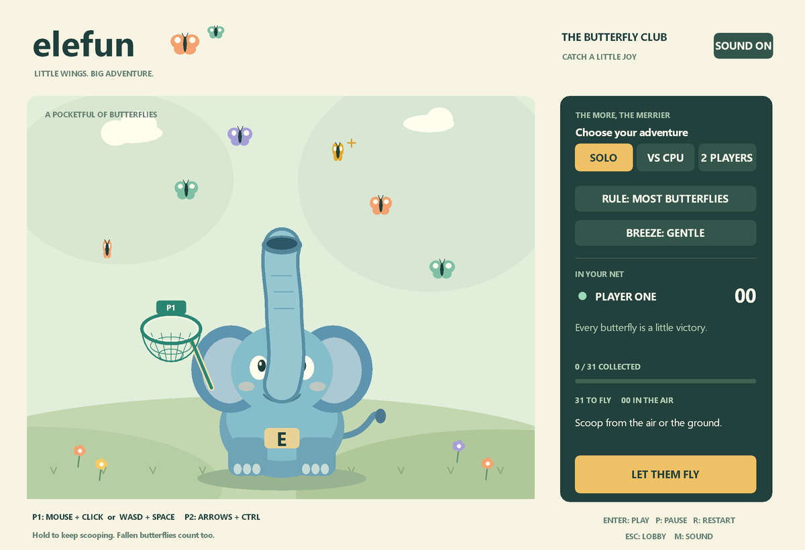
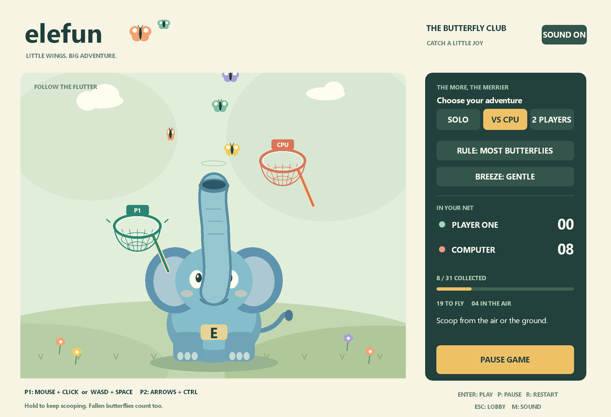

# Elefun

Catch a meadow full of butterflies with a friendly blue elephant. Play solo, race the computer, or share a game with a friend on the same PC.

A native C game for **Windows 10 or 11, 64 bit (x64)**. No installation or account is needed, and the game works offline.

**[Download Elefun.exe](https://github.com/agammann/elefun/raw/refs/heads/main/Elefun.exe)** · **[Download the complete project ZIP](https://github.com/agammann/elefun/archive/refs/heads/main.zip)**

## Start playing

1. Download **Elefun.exe** using the link above and open the downloaded file. You do not need to build anything.
2. Choose **SOLO**, **VS CPU**, or **2 PLAYERS** in the game window.
3. Choose **Most butterflies** or **Golden butterfly**, then choose a breeze setting. **Solo**, **Most butterflies**, and **Gentle** are a good first round.
4. Click **LET THEM FLY** or press **Enter**. After a three second countdown, move your net and scoop the butterflies as they drift down.

If you downloaded the project ZIP instead, right click it, choose **Extract All**, and open the extracted folder. Double click **Elefun.exe** or **Play.cmd** inside that folder.

This is a desktop game. It does not run inside GitHub or a web browser, and the included executable is not for macOS, Linux, or phones.

## Controls

| Player | Move the net | Scoop |
| :--- | :--- | :--- |
| Player one | Mouse inside the meadow, or **W A S D** | **Left mouse button** or **Space** |
| Player two | **Arrow keys** | **Ctrl** |

**Move and scoop together.** Moving over a butterfly alone does not catch it. Tap to scoop once, or hold the scoop button to repeat. Butterflies become catchable when they start falling; scoop fallen butterflies near the ground too.

Player one switches to keyboard movement when you use W A S D. Moving the mouse inside the meadow switches back to mouse control. For two people, mouse and left click for player one plus arrows and Ctrl for player two is the easiest arrangement.

| Key | Action |
| :--- | :--- |
| **Enter** | Start a round, play again, or resume |
| **P** | Pause or resume |
| **R** | Restart the round with scores reset and a fresh countdown |
| **Esc** | Leave the round and return to the lobby |
| **M** | Toggle sound |
| **1 / 2 / 3** | Select Solo / Vs CPU / 2 players |
| **G** | Switch between Most butterflies and Golden butterfly |
| **B** | Cycle Gentle, Breezy, and Gusty |

Mode, rule, and breeze choices can be changed before a round or on the results screen. Switching to another window automatically pauses the game. Return to the game and press **Enter** to resume. Close the window to quit.

## Rules and modes

Each round has **31 butterflies**, including one golden butterfly. Every catch is worth **one point**.

| Choice | Goal or effect |
| :--- | :--- |
| Solo | Catch as many of the 31 butterflies as you can |
| Vs CPU | Race a computer controlled net |
| 2 players | Compete on the same PC using the controls above |
| Most butterflies | The highest score wins; equal scores tie |
| Golden butterfly | Catch the golden butterfly to win immediately; if nobody catches it, the highest score wins and equal scores tie |
| Gentle / Breezy / Gusty | Change butterfly movement and computer net speed |

Once all butterflies have been released and none remain airborne, you have eight seconds to scoop those on the ground. Catching all 31 ends the round sooner. A round also has a 65 second time limit. Press **Enter** on the results screen to play again.

## Troubleshooting

| What you see | What to do |
| :--- | :--- |
| The net moves but catches nothing | Hold the scoop button while moving the rim of the net toward falling butterflies or those on the ground |
| Player two does not move | Select **2 PLAYERS** before starting; player two uses arrows and Ctrl |
| Player one's net follows the mouse unexpectedly | Keep the mouse still and use W A S D to return to keyboard control |
| The game pauses when you switch windows | This is automatic; return and press Enter |
| Some keys fail when two people play | Try mouse controls for player one; some keyboards cannot register many held keys at once |
| No sound | Press M to enable sound, then check Windows volume and the selected output device |
| Play.cmd cannot find the game | Extract the whole ZIP and keep Play.cmd beside Elefun.exe, or download Elefun.exe directly |

The game uses complete frames rendered offscreen, with no full screen flashes or blinking victory effects. For an issue that persists, [open an issue](https://github.com/agammann/elefun/issues) with your Windows version, game mode, and steps to reproduce it.

## Source and verification

The game is written in **C11** using Windows system libraries. Artwork is drawn in code and sounds are generated in memory.

**[Build and test instructions](BUILD.md)** · **[Verified behavior and testing limits](VERIFIED.md)**

| Path | Contents |
| :--- | :--- |
| `Elefun.exe` / `Play.cmd` | Ready to play game and optional launcher |
| `src/game.c` / `src/game.h` | Simulation, butterflies, nets, scoring, rules, and computer opponent |
| `src/main.c` | Windows controls, drawing, frame presentation, and audio |
| `tests/test_game.c` | Simulation and gameplay regression checks |
| `build.ps1` | Windows build and simulation test script |

## Inspiration

This is an independent fan project, not an official Hasbro product. Elefun is a Hasbro trademark. All code, artwork, and generated sounds are original; the project does not include Hasbro artwork, logos, recordings, or instruction sheets.

The blowing trunk, net catching, floor pickups, and optional golden butterfly rule draw inspiration from [Hasbro's older Elefun instructions](https://www.hasbro.com/common/documents/dad261551c4311ddbd0b0800200c9a66/70ED7C3C5056900B1093BCA0F582B8F9.pdf). This adaptation uses digital net controls and shorter rounds.
