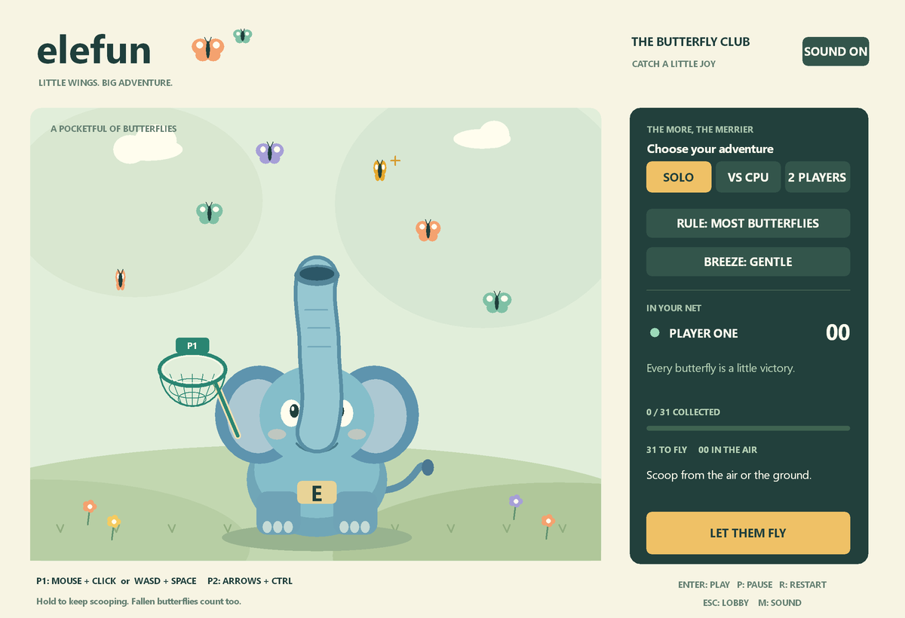
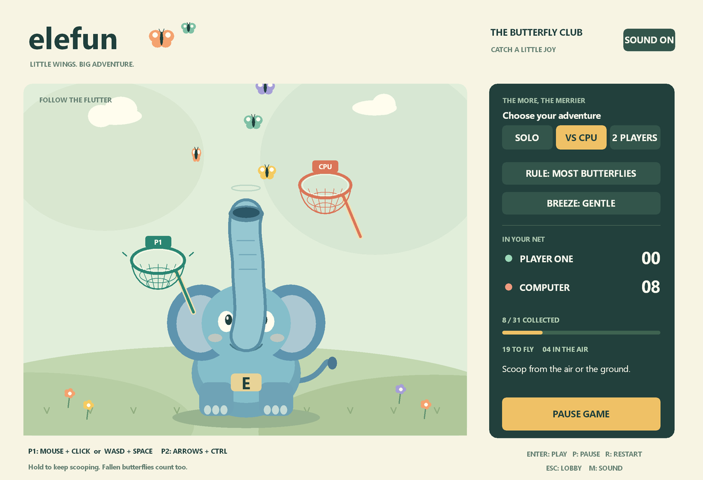

# Elefun

Catch 31 butterflies in a meadow with a friendly blue elephant. Play solo, race the computer, or share the same PC with a friend.

Elefun 1.0.0 runs offline on **Windows 10 or 11 x64**. No account, installer, game engine or downloaded artwork is required.

**[Download the Windows game](https://github.com/agammann/elefun/releases/download/v1.0.0/elefun_1.0.0_windows-x64.zip)** · **[Release and checksums](https://github.com/agammann/elefun/releases/tag/v1.0.0)** · **[Matching C source](https://github.com/agammann/elefun/releases/download/v1.0.0/elefun_1.0.0_source.zip)**

## Start playing

1. Download `elefun_1.0.0_windows-x64.zip` from the release above. The source ZIP is for developers.
2. Right click the ZIP, choose **Extract All**, and open its `Elefun-1.0.0` folder. Keep the files together.
3. Double click **Elefun.exe** or **Play.cmd**. The window title and executable file properties show version 1.0.0.
4. Start with **SOLO**, **Most butterflies**, and **Gentle**. Click **LET THEM FLY** or press **Enter**.
5. After the three second countdown, move your net and scoop butterflies as they fall. Press **Enter** on the results screen to play again.

To verify your download, get `SHA256SUMS` from the same release. In PowerShell, run `Get-FileHash .\elefun_1.0.0_windows-x64.zip -Algorithm SHA256` and compare the full hash with the Windows ZIP line in `SHA256SUMS` before extracting it. The release also includes an individual `.sha256` file for each ZIP.

This is a Windows desktop game. It does not run in GitHub or a browser. The executable is not a macOS, Linux, phone or Windows ARM build.

## Controls

| Player | Move the net | Scoop |
| :--- | :--- | :--- |
| Player one | Mouse inside the meadow, or **W A S D** | **Left mouse button** or **Space** |
| Player two | **Arrow keys** | **Ctrl** |

**Move and scoop together.** Moving over a butterfly alone does not catch it. Tap to scoop once, or hold to repeat. Butterflies become catchable when they start falling; scoop fallen butterflies near the ground too.

Using W A S D selects keyboard movement for player one. Moving the mouse inside the meadow selects mouse movement again. For two people, mouse and left click for player one plus arrows and Ctrl for player two is the easiest arrangement.

| Key | Action |
| :--- | :--- |
| **Enter** | Start, play again, or resume |
| **P** | Pause or resume |
| **R** | Restart with scores reset and a fresh countdown |
| **Esc** | Return to the lobby |
| **M** | Toggle sound |
| **1 / 2 / 3** | Select Solo / Vs CPU / 2 players |
| **G** | Switch Most butterflies / Golden butterfly |
| **B** | Cycle Gentle / Breezy / Gusty |

Choose mode, rule and breeze in the lobby or on the results screen. Results-screen choices apply to the next round: the completed winner, scores and players stay unchanged. Enter, **PLAY AGAIN**, or R starts with the selected choices.

Switching to another window automatically pauses the game and releases held inputs. Return and press Enter to resume that round. Close the window to quit. Closing loses the round; scores and settings are not saved between launches.

## Rules and modes

Each round releases **31 butterflies**, including one golden butterfly. Every catch is worth **one point**.

| Choice | Goal or effect |
| :--- | :--- |
| Solo | Catch as many of the 31 butterflies as you can |
| Vs CPU | Race a computer controlled net |
| 2 players | Compete on the same PC |
| Most butterflies | Highest score wins; equal scores tie |
| Golden butterfly | Catch gold to win immediately; otherwise highest score wins and equal scores tie |
| Gentle / Breezy / Gusty | Change butterfly movement and computer net speed |

After all butterflies are released and none remain airborne, you have eight seconds for floor pickups. Catching all 31 ends the round sooner. There is also a 65 second round limit.

## Troubleshooting and recovery

| What you see | What to do |
| :--- | :--- |
| Moving net catches nothing | Hold the scoop button while moving the net rim toward falling or grounded butterflies |
| Player two does not move | Select **2 PLAYERS** before starting; use arrows and Ctrl |
| Player one follows the mouse unexpectedly | Keep the mouse still and use W A S D to select keyboard control |
| Round pauses after changing windows | Return to Elefun and press Enter |
| Some held keys do not register | Use mouse controls for player one; keyboard hardware may limit simultaneous keys |
| No sound | Press M, then check Windows volume and output device; the game can still be played silently |
| Play.cmd reports a missing executable | Extract the complete **Windows** ZIP again; in the **source** ZIP build first using BUILD.md |
| A round feels stuck | Press R for a fresh countdown or Esc for the lobby; there is no persistent game data to lose |
| Download or build does not match the expected version | Keep the downloaded ZIP and checksum result; use the matching release instead of mixing versions |

To upgrade, close the game and extract the new release to a new folder. Keep the old folder until the new version launches. To uninstall, close Elefun and delete its extracted folder. No account, registry settings, saved rounds or scores need migration.

For an issue, [open an issue](https://github.com/agammann/elefun/issues) with the version shown in the title or file properties, Windows version, mode/rule/breeze, expected behavior and steps to reproduce. For build failures include the compiler version and terminal output; for native checks include both result and details files. See [verification notes](VERIFIED.md) for the actual check scope.

## Build on it

The C11 simulation is separate from Windows input, rendering and generated audio. A source build needs Windows PowerShell and the complete LLVM MinGW toolchain. Start with [BUILD.md](BUILD.md); no Git installation is required to build an extracted source release.

| Path | Contents |
| :--- | :--- |
| `src/game.c` / `src/game.h` | Butterflies, nets, scoring, rules and computer opponent |
| `src/main.c` | Win32 controls, rendering, native checks and generated audio |
| `src/version.h` / `src/version.rc` | Source and Windows executable version |
| `tests/test_game.c` | Complete-round simulation and regression checks |
| `build.ps1` | Builds and checks a fresh executable in `build/` |
| `scripts/` | Matching source/Windows ZIP packaging, consumer verification and release publisher |
| `Play.cmd` | Source launcher for `build/Elefun.exe`; Windows ZIP launcher opens its sibling executable |

The [MIT license](LICENSE) covers this project's original code, drawn artwork and generated sounds. See [release preparation](docs/RELEASING.md) for changing a version and producing matching packages.

## Inspiration

This is an independent fan project, not an official Hasbro product. Elefun is a Hasbro trademark. Original code, artwork and generated sounds are included; Hasbro artwork, logos, recordings and instruction sheets are not.

The blowing trunk, net catching, floor pickups and optional golden butterfly rule draw inspiration from [Hasbro's older Elefun instructions](https://www.hasbro.com/common/documents/dad261551c4311ddbd0b0800200c9a66/70ED7C3C5056900B1093BCA0F582B8F9.pdf). This adaptation uses digital controls and shorter rounds.
